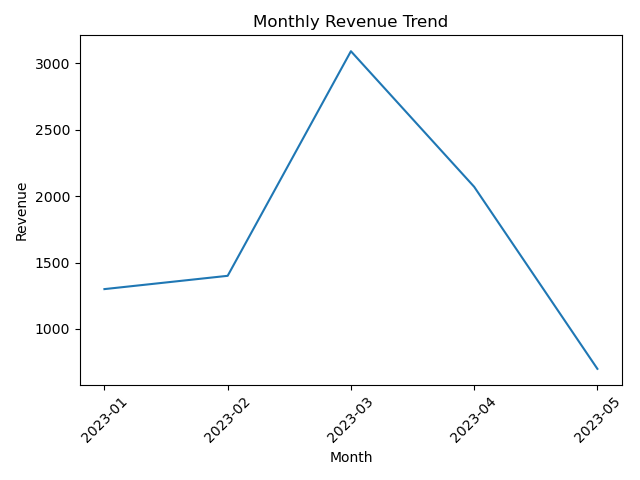
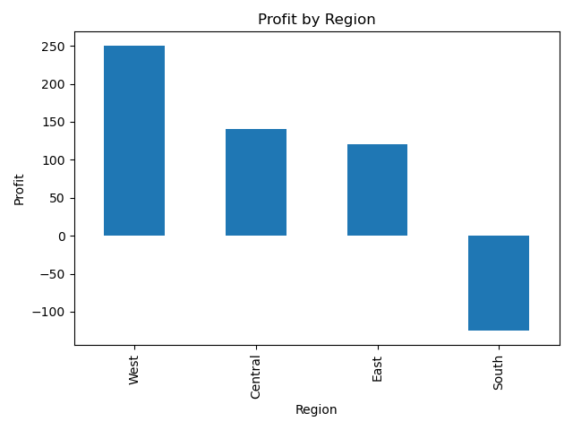
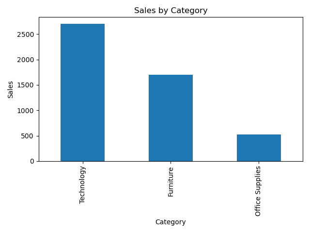
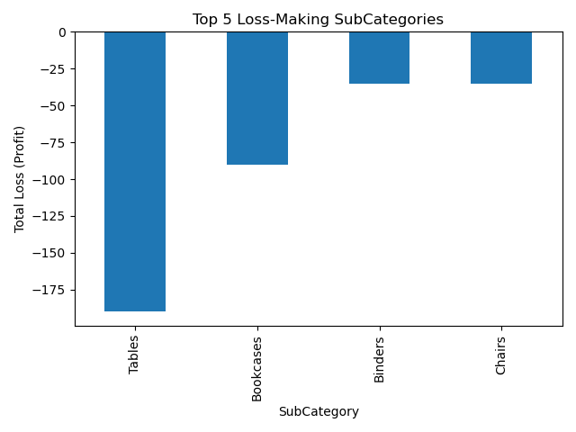

# Sales Dashboard using Python

This project analyzes retail sales data and generates business insights using Python.

## Tools
- Python
- Pandas
- Matplotlib
- Data Analysis

## Business Questions Answered
- Monthly revenue trend
- Profit by region
- Sales by category
- Loss making products

## Results
The dashboard identifies which product categories generate profit and which cause business losses.

## Visualizations
Below are generated insights:

### Monthly Revenue Trend

### Profit by Region

### Sales by Category

### Loss Making Subcategories

## Author
Preetham Padala
MS Data Science | Python | SQL | Data Analyst

