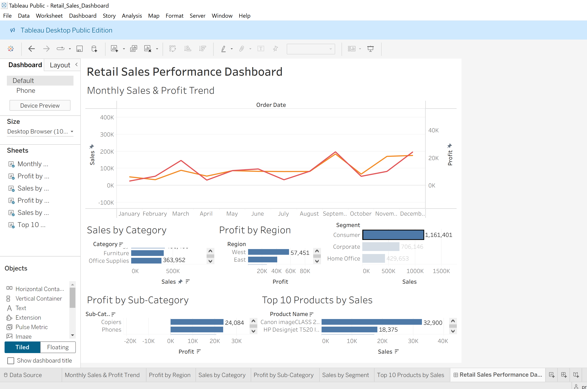
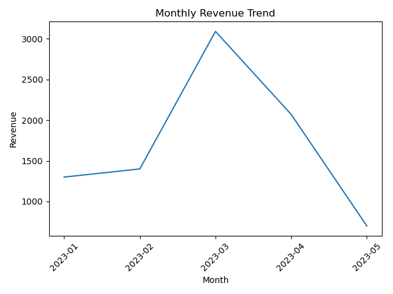
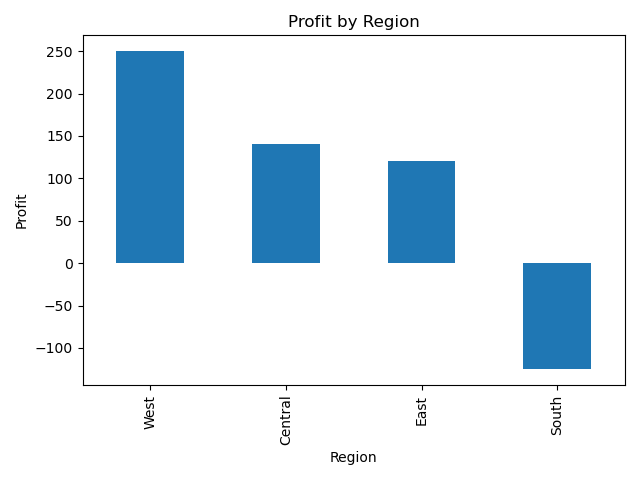
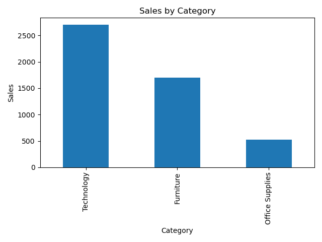
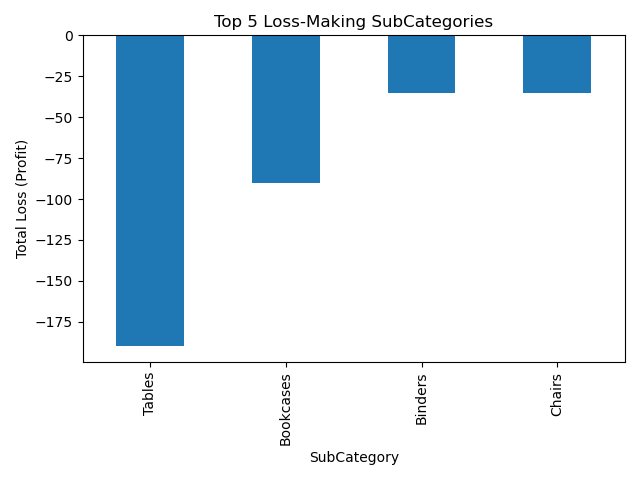

# Sales Dashboard using Python

This project analyzes retail sales data and generates business insights using Python.

## Tools Used

- Python
- Pandas
- Matplotlib
- Data Analysis
- Data Visualization

## Business Questions Answered

This project answers important business questions such as:

- How do sales change across months?
- Which regions generate the most profit?
- Which product categories drive revenue?
- Which sub-categories are causing losses?
- How can businesses identify profitable products and regions?

## Key Business Insights

The dashboard provides several important insights for business decision-making:

- Technology products generate the highest sales revenue.
- Some product sub-categories generate negative profit, indicating pricing or discount issues.
- Certain regions contribute significantly more profit than others.
- Sales trends fluctuate throughout the year, indicating seasonal demand patterns.

## Visualizations and Business Insights

Below are the generated insights from the sales dashboard.

---

### Monthly Revenue Trend

**Insight**

Sales fluctuate across months with noticeable peaks during high-demand periods.  
This indicates seasonal purchasing behavior.

**Business Value**

Companies can prepare inventory and marketing campaigns for high-demand months.

---

### Profit by Region

**Insight**

The West region generates the highest profit, while other regions contribute less.

**Business Value**

Businesses can expand operations or marketing in profitable regions and improve strategies in weaker markets.

---

### Sales by Category

**Insight**

Technology products generate the highest revenue compared to Furniture and Office Supplies.

**Business Value**

Businesses should focus on high-performing categories for revenue growth.

---

### Loss Making Subcategories

**Insight**

Some sub-categories generate negative profit.

Possible causes include high discounts, low pricing, or operational costs.

**Business Value**

Businesses can reduce losses by adjusting pricing strategies or optimizing supply chain costs.
## Tableau Dashboard

Interactive dashboard created using Tableau.

View it here:

[View Dashboard on Tableau Public](https://public.tableau.com/app/profile/yourname/viz/yourdashboardname)

## Author
Preetham Padala
MS Data Science | Python | SQL | Data Analyst

